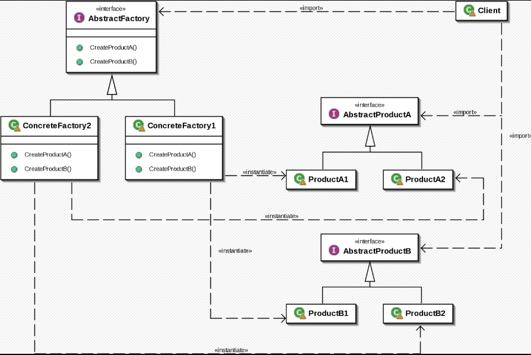

## 抽象工厂模式-- abstract factory
## 模式定义:
提供一个创建一系列相关或互相依赖对象的接口，而无需指定它们具体的类

## 代码示例：
```
package com.xiaokey.design.pattern.abstractfactory;

/**
 * @author chenhao
 * @net xiaokey.com
 */
public class AbstractFactoryTest {
    public static void main(String[] args) {

        IDBComponent idbComponent = new MysqlDbComponent(); // config.

        IConnection connection = idbComponent.getConnection();
        connection.connection();

        ICommand command = idbComponent.getCommand();
        command.command();

    }
}
//  变化:        mysql , sqlserver , oracle ........
//  c/s(稳定):   connection, command, ......

interface IConnection {

    void connection();
}

interface ICommand {

    void command();
}


interface IDBComponent {

    IConnection getConnection();

    ICommand getCommand();
}

// ------------------

class MyConnection implements IConnection {

    @Override
    public void connection() {
        System.out.println("mysql: connect.");
    }
}

class MyCommand implements ICommand {

    @Override
    public void command() {
        System.out.println("mysql: command.");
    }
}

class MysqlDbComponent implements IDBComponent {

    @Override
    public IConnection getConnection() {
        return new MyConnection();
    }

    @Override
    public ICommand getCommand() {
        return new MyCommand();
    }
}
//--------oracle

class OracleConnection implements IConnection {


    @Override
    public void connection() {
        System.out.println("oracle:connect.");
    }
}

class OracleCommand implements ICommand {

    @Override
    public void command() {
        System.out.println("oracle:command.;");
    }
}

class OralceDbComponent implements IDBComponent {

    @Override
    public IConnection getConnection() {
        return new OracleConnection();
    }

    @Override
    public ICommand getCommand() {
        return new OracleCommand();
    }
}
```


## 应用场景:
程序需要处理不同系列的相关产品，但是您不希望它依赖于这些产品的具体类时，
可以使用抽象工厂


## 优点:

1.可以确信你从工厂得到的产品彼此是兼容的。

2.可以避免具体产品和客户端代码之间的紧密耦合。

3.符合单一职责原则

4.符合开闭原则


### jdk源码中的应用：

1.java.sql.connection

2.java.sql.driver