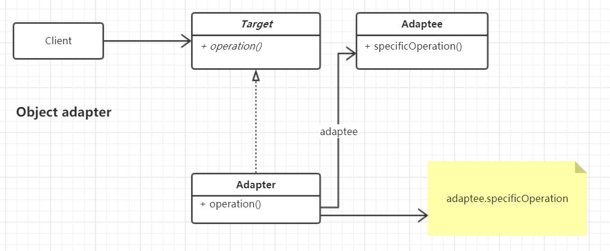
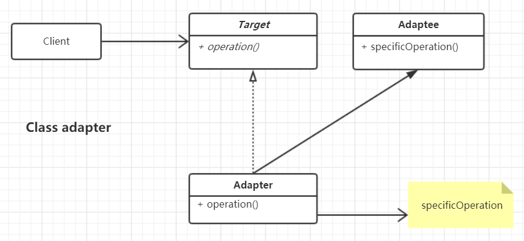

## 适配器模式-- Adapter
## 模式定义:
将一个类的接口转换成客户希望的另一个接口。Adapter模式使得原本由于接口不兼容而不能一起工作的那些类可以一起工作

object adapter



class adapter



## object adapter 代码示例：
```
package com.xiaokey.design.pattern.adapter.v1;

/**
 * @author chenhao
 * @net xiaokey.com
 * @desc 对象适配器模式
 */
public class AdapterTest1 {
    public static void main(String[] args) {
        Adaptee adaptee = new Adaptee();

        Target target = new Adapter(adaptee);
        target.output5v();

    }
}

class Adaptee {
    public int output220v() {
        return 220;
    }
}

interface Target {
    int output5v();
}

class Adapter implements Target {

    private Adaptee adaptee;

    public Adapter(Adaptee adaptee) {
        this.adaptee = adaptee;
    }

    @Override
    public int output5v() {
        int i = adaptee.output220v();
        System.out.println(String.format("原始电压： %d v  - >  输出电压： %d  v  ", i, 5));
        return 5;
    }
}
```

## class adapter 代码示例：
```
package com.xiaokey.design.pattern.adapter.v2;

/**
 * @author chenhao
 * @net xiaokey.com
 * @desc 类适配器模式
 */
public class AdapterTest2 {
    public static void main(String[] args) {
        Adapter adapter = new Adapter();
        adapter.output5v();

    }
}

class Adaptee {
    public int output220v() {
        return 220;
    }
}

interface Target {
    int output5v();
}

class Adapter extends Adaptee implements Target {

    @Override
    public int output5v() {
        int i = output220v();
        System.out.println(String.format("原始电压： %d v  - >  输出电压： %d  v  ", i, 5));
        return 5;
    }
}
```


## 应用场景:
1.当你希望使用某些现有类，但其接口与您的其他代码不兼容时，请使用适配器类。

2.当你希望重用几个现有的子类，这些子类缺少一些不能添加到超类中的公共功能时，请使用该模式。


## 优点:
1.符合单一职责原则

2.符合开闭原则


### jdk源码中的应用：
JDK: 

1.java.util.Arrays#asList() 

2.java.util.Collections#list() 

Spring: 

1.org.springframework.context.event.GenericApplicationListenerAdapter