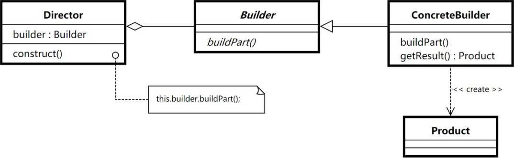

## 建造者模式-- Builder
## 模式定义:
    将一个复杂对象的创建与他的表示分离，使得同样的构建过程可以创建不同的表示



## builder代码示例：
```
package com.xiaokey.design.pattern.builder.v1;

/**
 * @author chenhao
 * @net xiaokey.com
 * @模式： 建造者模式
 * @应用场景： 1.需要生成的对象具有复杂的内部结构 2.需要生成的对象内部属性本身相互依赖 3.与不可变对象配合使用
 * @优点： 1、建造者独立，易扩展。 2、便于控制细节风险。
 */
public class BuilderTest {
    public static void main(String[] args) {

        ProductBuilder productBuilder = new DefaultProductBuilder();

        Director director = new Director(productBuilder);
        Product product = director.makeProduct("part1", "part2", "part3", "part4");
        System.out.println(product);


    }
}

interface ProductBuilder {

    void buildPart1(String part1);

    void buildPart2(String part2);

    void buildPart3(String part3);

    void buildPart4(String part4);

    Product build();
}

class DefaultProductBuilder implements ProductBuilder {

    private String part1;
    private String part2;
    private String part3;
    private String part4;

    @Override
    public void buildPart1(String part1) {
        this.part1 = part1;
    }

    @Override
    public void buildPart2(String part2) {
        this.part2 = part2;
    }

    @Override
    public void buildPart3(String part3) {
        this.part3 = part3;
    }

    @Override
    public void buildPart4(String part4) {
        this.part4 = part4;
    }

    @Override
    public Product build() {
        return new Product(part1, part2, part3, part4);
    }
}

class Director {

    private ProductBuilder productBuilder;

    public Director(ProductBuilder productBuilder) {
        this.productBuilder = productBuilder;
    }

    public Product makeProduct(String part1, String part2, String part3, String part4) {
        productBuilder.buildPart1(part1);
        productBuilder.buildPart2(part2);
        productBuilder.buildPart3(part3);
        productBuilder.buildPart4(part4);
        Product product = productBuilder.build();
        return product;

    }

}


class Product {


    private String part1;
    private String part2;
    private String part3;
    private String part4;


    public Product(String part1, String part2, String part3, String part4) {
        this.part1 = part1;
        this.part2 = part2;
        this.part3 = part3;
        this.part4 = part4;
    }

    public String getPart1() {
        return part1;
    }

    public void setPart1(String part1) {
        this.part1 = part1;
    }

    public String getPart2() {
        return part2;
    }

    public void setPart2(String part2) {
        this.part2 = part2;
    }

    public String getPart3() {
        return part3;
    }

    public void setPart3(String part3) {
        this.part3 = part3;
    }

    public String getPart4() {
        return part4;
    }

    public void setPart4(String part4) {
        this.part4 = part4;
    }

    @Override
    public String toString() {
        return "Product{" +
                "part1='" + part1 + '\'' +
                ", part2='" + part2 + '\'' +
                ", part3='" + part3 + '\'' +
                ", part4='" + part4 + '\'' +
                '}';
    }
}


```

## 建造者模式与不可变对象配合使用 代码示例：
```
package com.xiaokey.design.pattern.builder.v2;

/**
 * @author chenhao
 * @net xiaokey.com
 * @模式： 建造者模式与不可变对象配合使用
 * @应用场景： 1.需要生成的对象具有复杂的内部结构 2.需要生成的对象内部属性本身相互依赖 3.与不可变对象配合使用
 * @优点： 1、建造者独立，易扩展。 2、便于控制细节风险。
 */
public class BuilderTest2 {
    public static void main(String[] args) {

        Product.Builder builder = new Product.Builder().builderPart1("part1").builderPart2("part2");

        if (false) {
            builder.builderPart3("part3");
        }

        Product.Builder part4 = builder.builderPart4("part4");
        Product product = part4.build();
        System.out.println(product);
    }
}

class Product {

    private final String part1;
    private final String part2;
    private final String part3;
    private final String part4;
    //  .....


    public Product(String part1, String part2, String part3, String part4) {
        this.part1 = part1;
        this.part2 = part2;
        this.part3 = part3;
        this.part4 = part4;
    }

    public String getPart1() {
        return part1;
    }

    public String getPart2() {
        return part2;
    }

    public String getPart3() {
        return part3;
    }

    public String getPart4() {
        return part4;
    }

    @Override
    public String toString() {
        return "Product{" +
                "part1='" + part1 + '\'' +
                ", part2='" + part2 + '\'' +
                ", part3='" + part3 + '\'' +
                ", part4='" + part4 + '\'' +
                '}';
    }


    static class Builder {
        private String part1;
        private String part2;
        private String part3;
        private String part4;

        public Builder builderPart1(String part1) {
            this.part1 = part1;
            return this;
        }

        public Builder builderPart2(String part2) {
            this.part2 = part2;
            return this;
        }

        public Builder builderPart3(String part3) {
            this.part3 = part3;
            return this;
        }

        public Builder builderPart4(String part4) {
            this.part4 = part4;
            return this;
        }

        Product build() {
            return new Product(part1, part2, part3, part4);
        }

    }
}
```


## 应用场景:
    1.需要生成的对象具有复杂的内部结构
    2.需要生成的对象内部属性本身相互依赖与不可变对象配合使用

## 优点:
    1、建造者独立，易扩展。
    2、便于控制细节风险。

### 经典案例：
    org.springframework.web.servlet.mvc.method.RequestMappingInfo
    org.springframework.beans.factory.support.BeanDefinitionBuilder