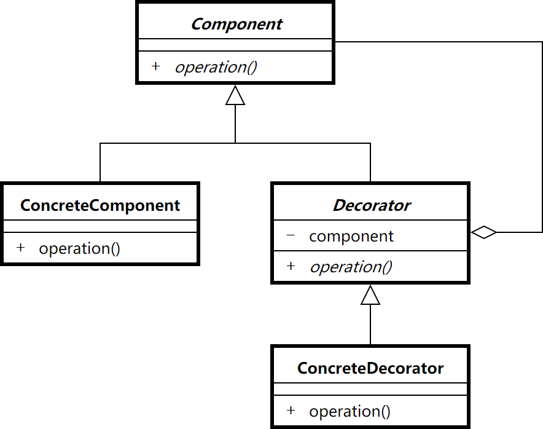

## 装饰者模式-- Decorator
## 模式定义:
    在不改变原有对象的基础上，将功能附加到对象上



## Decorator 代码示例：
```
package com.xiaokey.design.pattern.decorator;

/**
 * @author chenhao
 * @net xiaokey.com
 * @desc 装饰器模式
 * @应用场景：扩展一个类的功能或给一个类添加附加职责
 * @优点: 1.不改变原有对象的情况下给一个对象扩展功能 2.使用不同的组合可以实现不同的效果 3.符合开闭原则
 */
public class DecoratorTest {
    public static void main(String[] args) {
        Component component = new ConcreteDecorator2(new ConcreteDecorator1(new ConcreteComponent()));
        component.operation();
    }
}

interface Component {
    void operation();
}

class ConcreteComponent implements Component {

    @Override
    public void operation() {
        System.out.println("拍照.");
    }
}

abstract class Decorator implements Component {
    Component component;

    public Decorator(Component component) {
        this.component = component;
    }
}

class ConcreteDecorator1 extends Decorator {

    public ConcreteDecorator1(Component component) {
        super(component);
    }

    @Override
    public void operation() {
        System.out.println("添加美颜.");
        component.operation();
    }
}

class ConcreteDecorator2 extends Decorator {


    public ConcreteDecorator2(Component component) {
        super(component);
    }

    @Override
    public void operation() {
        System.out.println("添加滤镜.");
        component.operation();
    }
}
```


## 应用场景:
    扩展一个类的功能或给一个类添加附加职责


## 优点:
    1.不改变原有对象的情况下给一个对象扩展功能
    2.使用不同的组合可以实现不同的效果
    3.符合开闭原则


### 经典案例：
    1.javax.servlet.http.HttpServletRequestWrapper
    2.javax.servlet.http.HttpServletResponseWrapper