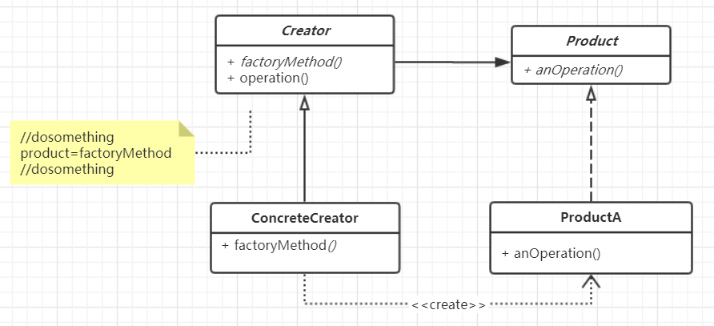

## 工厂方法-- Factory method
## 模式定义:
定义一个用于创建对象的接口，让子类决定实例化哪一个类。Factory Method 使得一个类的实例化延迟到子类



## Factory method 代码示例：
```
package com.xiaokey.design.pattern.factorymethod;

/**
 * @author chenhao
 * @net xiaokey.com
 * @desc 工厂方法模式
 */
public class FactoryMethodTest {
    public static void main(String[] args) {
        Application application = new ConcreteProductB();
        Product product = application.getObject();
        product.method1();

    }
}

interface Product {
    void method1();
}

class ProductA implements Product {

    @Override
    public void method1() {
        System.out.println("ProductA.method1 executed.");
    }
}

class ProductB implements Product {

    @Override
    public void method1() {
        System.out.println("ProductB.method1 executed.");
    }
}


// 简单工厂
class SimpleFactory {
    public static Product createProduct(String type) {
        if ("A".equals(type)) {
            return new ProductA();
        }

        return null;
    }
}

//  变化 ， 共同点
abstract class Application {

    // 工厂方法
    public abstract Product createProduct();

    public Product getObject() {

        Product product = createProduct();
        // ......
        return product;
    }
}

class ConcreteProductA extends Application {

    @Override
    public Product createProduct() {
        ProductA productA = new ProductA();
        // ...
        return productA;
    }
}


class ConcreteProductB extends Application {

    @Override
    public Product createProduct() {
        ProductB productB = new ProductB();
        return productB;
    }
}
```


## 应用场景:
1.当你不知道该使用对象的确切类型的时候

2.当你希望为库或框架提供扩展其内部组件的方法时


## 优点:
1.将具体产品和创建者解耦

2.符合单一职责原则

3.符合开闭原则


### 经典案例：
java api 静态工厂方法

1.Calendar.getInstance()

2.java.text.NumberFormat.getInstance()

3.java.util.ResourceBundle.getBundle() 

工厂方法

1.java.net.URLStreamHandlerFactory

2.javax.xml.bind.JAXBContext.createMarshaller