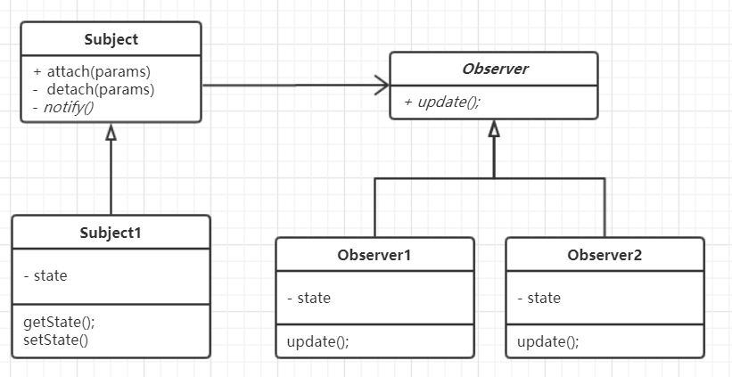

## 观察者模式-- Observer
## 模式定义:
定义了对象之间的一对多依赖，让多个观察者对象同时监听某一个主题对象，当主题对象发生变化时，它的所有依赖者都会收到通知并更新



## Observer 代码示例：
```
package com.xiaokey.design.pattern.observer;


import java.util.ArrayList;
import java.util.List;

/**
 * @author chenhao
 * @net xiaokey.com
 */
public class ObserverTest {
    public static void main(String[] args) {

        Subject subject = new Subject();
        Task1 task1 = new Task1();
        subject.addObserver(task1);
        Task2 task2 = new Task2();
        subject.addObserver(task2);

        subject.notifyObserver("xxxxx ");
        System.out.println("------------------");
        subject.remove(task1);
        subject.remove(task2);
        subject.notifyObserver("yyyyyy ");


    }
}

class Subject {
    // 容器
    private List<Observer> container = new ArrayList<>();

    // add
    public void addObserver(Observer observer) {
        container.add(observer);
    }

    // remove
    public void remove(Observer observer) {
        container.remove(observer);
    }

    public void notifyObserver(Object object) {
        for (Observer item : container) {
            item.update(object);
        }

    }
}


interface Observer {
    void update(Object object);
}

class Task1 implements Observer {

    @Override
    public void update(Object object) {
        System.out.println(" task1 received: " + object);
    }
}

class Task2 implements Observer {

    @Override
    public void update(Object object) {
        System.out.println(" task2 received:" + object);
    }
}
```


## 应用场景:
当更改一个对象的状态可能需要更改其他对象，并且实际的对象集事先未知或动态更改时，请使用观察者模式。


## 优点:
1.符合开闭原则

2.可以在运行时建立对象之间的关系


### 经典案例：
JDK:

java.util.Observable

Spring:

org.springframework.context.ApplicationListener