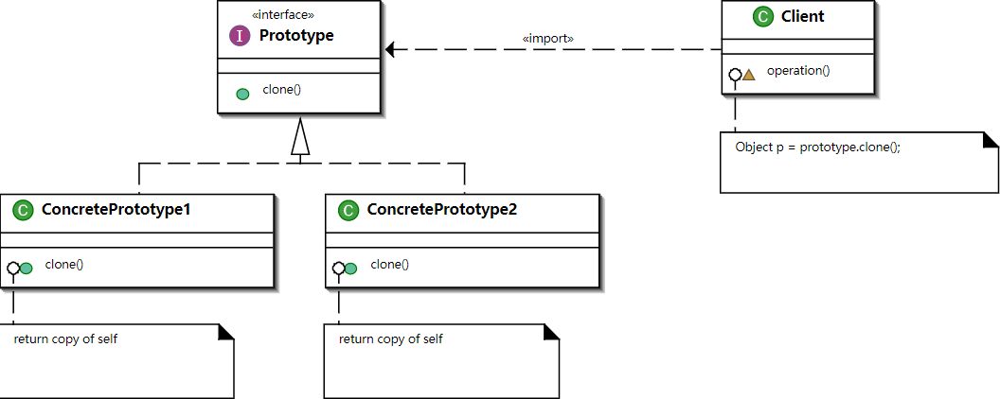

## 原型模式-- Prototype
## 模式定义:
指原型实例指定创建对象的种类，并且通过拷贝这些原型创建新的对象。




## Prototype 代码示例：
```
package com.xiaokey.design.pattern.prototype;

import java.io.*;

/**
 * @author chenhao
 * @net xiaokey.com
 * <p>
 * <p>
 * <p>
 * 如果对应的类中的字段为 8 种原生数据类型，或者8种原生数据类型的包装类型，或String，BigInteger
 * 则只需要实现Cloneable这个接口且覆盖Object.clone方法，即可利用jvm的克隆机制，完成对象的拷贝
 * 这种方式即是浅拷贝， 如果对应的类中数据为自定义数据类型，或者其他可变的数据类型（如Date,或者其
 * 他对象类型），要借助jvm的克隆机制完成数据的拷贝，则需要实现所有的对象字段的遍历拷贝，即是深拷贝
 */
public class PrototypeTest {
    public static void main(String[] args) throws CloneNotSupportedException {

        BaseInfo baseInfo = new BaseInfo("tuling");
        Product product = new Product("part1", "part2", "part3", "part4", baseInfo);

        Product clone = product.clone();
        System.out.println("original: " + product);
        System.out.println("clone:  " + clone);
        product.getBaseInfo().setCompanyName("xxxx");
        System.out.println("original: " + product);
        System.out.println("clone:  " + clone);


    }
}

class BaseInfo implements Cloneable, Serializable {
    private String companyName;

    public BaseInfo(String companyName) {
        this.companyName = companyName;
    }

    public String getCompanyName() {
        return companyName;
    }

    public void setCompanyName(String companyName) {
        this.companyName = companyName;
    }

    @Override
    protected BaseInfo clone() throws CloneNotSupportedException {
        return ((BaseInfo) super.clone());
    }

    @Override
    public String toString() {
        return hashCode() + " ]BaseInfo{" +
                "companyName='" + companyName + '\'' +
                '}';
    }
}


class Product implements Cloneable, Serializable {

    static final long serialVersionUID = 6772397503790075095L;

    private String part1;
    private String part2;
    private String part3;
    private String part4;
    // 自定义数据类型
    private BaseInfo baseInfo;

    private String part5;


    public Product(String part1, String part2, String part3, String part4, BaseInfo baseInfo) {
        this.part1 = part1;
        this.part2 = part2;
        this.part3 = part3;
        this.part4 = part4;
        this.baseInfo = baseInfo;
    }

    public String getPart1() {
        return part1;
    }

    public void setPart1(String part1) {
        this.part1 = part1;
    }

    public String getPart2() {
        return part2;
    }

    public void setPart2(String part2) {
        this.part2 = part2;
    }

    public String getPart3() {
        return part3;
    }

    public void setPart3(String part3) {
        this.part3 = part3;
    }

    public String getPart4() {
        return part4;
    }

    public void setPart4(String part4) {
        this.part4 = part4;
    }


    public BaseInfo getBaseInfo() {
        return baseInfo;
    }

    public void setBaseInfo(BaseInfo baseInfo) {
        this.baseInfo = baseInfo;
    }


    @Override
    protected Product clone() throws CloneNotSupportedException {
        // 利用jvm克隆机制完成的深拷贝
//        Product productClone= ((Product) super.clone());
//        BaseInfo clone1=this.baseInfo.clone();
//        productClone.setBaseInfo( clone1 );
//        return productClone ;

        // 序列化方式实现的深拷贝
        ByteArrayOutputStream byteArrayOutputStream = new ByteArrayOutputStream();

        try (ObjectOutputStream oos = new ObjectOutputStream(byteArrayOutputStream)) {
            oos.writeObject(this);
        } catch (IOException e) {
            e.printStackTrace();
        }
        ByteArrayInputStream byteArrayInputStream = new ByteArrayInputStream(byteArrayOutputStream.toByteArray());

        try (ObjectInputStream ois = new ObjectInputStream(byteArrayInputStream)) {
            Product o = ((Product) ois.readObject());
            return o;
        } catch (IOException e) {
            e.printStackTrace();
        } catch (ClassNotFoundException e) {
            e.printStackTrace();
        }
        return null;
    }

    @Override
    public String toString() {
        return super.hashCode() + " ] Product{" +
                "part1='" + part1 + '\'' +
                ", part2='" + part2 + '\'' +
                ", part3='" + part3 + '\'' +
                ", part4='" + part4 + '\'' +
                ", baseInfo='" + baseInfo + '\'' +
                '}';
    }
}
```


## 应用场景:
当代码不应该依赖于需要复制的对象的具体类时，请使用Prototype模式。


## 优点:
1.可以不耦合具体类的情况下克隆对象

2.避免重复的初始化代码

3.更方便的构建复杂对象

## 知识点：
1.Cloneable接口/Object#clone方法 详解2.浅拷贝/深拷贝

3.序列化机制实现深拷贝


### 经典案例：
org.springframework.beans.factory.support.AbstractBeanDefinition

java.util.Arrays