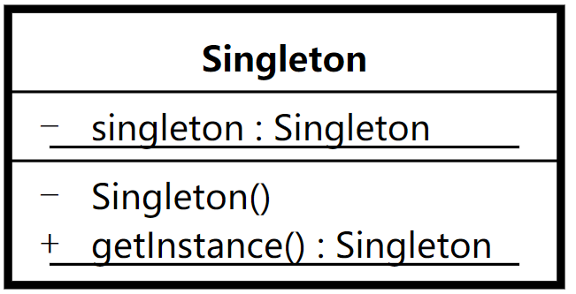

## 单例模式-- Singleton
## 模式定义:
保证一个类只有一个实例，并且提供一个全局访问点



## LazySingleton 代码示例：
1.懒汉模式：延迟加载， 只有在真正使用的时候，才开始实例化。

    1）线程安全问题
    2）double check 加锁优化
    3）编译器(JIT),CPU 有可能对指令进行重排序，导致使用到尚未初始化的实例，可以通过添加volatile 关键字进行修饰，对于volatile 修饰的字段，可以防止指令重排。
```
package com.xiaokey.design.pattern.singleton.v1;

/**
 * @author chenhao
 * @net xiaokey.com
 */
public class LazySingletonTest {
    public static void main(String[] args) {


        Thread thread1 = new Thread(() -> {
            LazySingleton instance = LazySingleton.getInstance();
            System.out.println(instance);

        });


        Thread thread2 = new Thread(() -> {
            LazySingleton instance = LazySingleton.getInstance();
            System.out.println(instance);

        });

        thread1.start();
        thread2.start();


    }
}

class LazySingleton {

    private volatile static LazySingleton instance;

    private LazySingleton() {

    }

    public static LazySingleton getInstance() {

        if (instance == null) {

            synchronized (LazySingleton.class) {
                if (instance == null) {
                    // JIT， CPU
                    instance = new LazySingleton();
                    //  1.分配空间
                    //  2.初始化
                    //  3.赋值

                }

            }

        }
        return instance;
    }
}
```

## HungrySingleton 代码示例：
1.饿汉模式：类加载的 初始化阶段就完成了 实例的初始化 。本质上就是借助于jvm 类加载机制，保证实例的唯一性（初始化过程只会执行一次）及线程安全（JVM以同步的形式来完成类加载的整个过程）。类加载过程：

    1）加载二进制数据到内存中， 生成对应的Class数据结构
    2）连接： a. 验证， b.准备（给类的静态成员变量赋默认值），c.解析
    3）初始化： 给类的静态变量赋初值
```
package com.xiaokey.design.pattern.singleton.v2;

/**
 * @author chenhao
 * @net xiaokey.com
 */
public class HungrySingletonTest {
    public static void main(String[] args) {
        HungrySingleton instance = HungrySingleton.getInstance();
        HungrySingleton instance1 = HungrySingleton.getInstance();
        System.out.println(instance == instance1);
    }
}

class HungrySingleton {

    private static HungrySingleton instance = new HungrySingleton();

    private HungrySingleton() {

    }

    public static HungrySingleton getInstance() {
        return instance;
    }
}
```

## InnerClassSingleton 代码示例：
1.静态内部类

    1）本质上是利用类的加载机制来保证线程安全
    2）只有在实际使用的时候，才会触发类的初始化，所以也是懒加载的一种形式。
    3) 静态内部类防止反射破坏
```
package com.xiaokey.design.pattern.singleton.v3;

import java.io.*;
import java.lang.reflect.InvocationTargetException;

/**
 * @author chenhao
 * @net xiaokey.com
 */
public class InnerClassSingletonTest {
    public static void main(String[] args) throws NoSuchMethodException, IllegalAccessException, InvocationTargetException, InstantiationException, IOException {
        //        InnerClassSingleton instance=InnerClassSingleton.getInstance();
        //        InnerClassSingleton instance1=InnerClassSingleton.getInstance();
        //
        //        System.out.println(instance==instance1);
        // System.out.println(InnerClassSingleton.name);


//        Constructor<InnerClassSingleton> declaredConstructor=InnerClassSingleton.class.getDeclaredConstructor();
//        declaredConstructor.setAccessible( true );
//        InnerClassSingleton innerClassSingleton=declaredConstructor.newInstance();
//        InnerClassSingleton instance=InnerClassSingleton.getInstance();
//
//        System.out.println(innerClassSingleton==instance);

        InnerClassSingleton instance = InnerClassSingleton.getInstance();
//        try(ObjectOutputStream oos=new ObjectOutputStream( new FileOutputStream( "instance" ) )) {
//            oos.writeObject( instance );
//        }

        try (ObjectInputStream ois = new ObjectInputStream(new FileInputStream("instance"))) {
            InnerClassSingleton innerClassSingleton = (InnerClassSingleton) ois.readObject();

            System.out.println(innerClassSingleton == instance);

        } catch (ClassNotFoundException e) {
            e.printStackTrace();
        }


    }
}

class InnerClassSingleton implements Serializable {
    // private static final long serialVersionUID = 6922639953390195232L;
    // private  static final long serialVersionUID = 42L;
    public static String name = "yyy";
    public static String name1 = "yyy";
    public static String name2 = "yyy";

    static {
        System.out.println(" InnerClassSingleton "); //  1
    }

    private InnerClassSingleton() {

        if (SingletonHolder.instance != null) {
            throw new RuntimeException(" 不允许多个实例。");
        }

    }

    public static InnerClassSingleton getInstance() {
        return SingletonHolder.instance;
    }

    Object readResolve() throws ObjectStreamException {
        return SingletonHolder.instance;
    }

    private static class SingletonHolder {
        private static InnerClassSingleton instance = new InnerClassSingleton();

        static {
            System.out.println(" SingletonHolder ");// 2
        }
    }
}
```
## EnumSingleton 代码示例：
1.枚举类型

    1）天然不支持反射创建对应的实例，且有自己的反序列化机制
    2）利用类加载机制保证线程安全
```
package com.xiaokey.design.pattern.singleton.v4;

import java.io.*;

/**
 * @author chenhao
 * @net xiaokey.com
 */
public class EnumSingletonTest {
    public static void main(String[] args) throws IOException {
        EnumSingleton instance = EnumSingleton.INSTANCE;
//        EnumSingleton instance1=EnumSingleton.INSTANCE;
//        System.out.println(instance==instance1);

//        try(ObjectOutputStream oos=new ObjectOutputStream( new FileOutputStream( "EnumSingleton" ) )) {
//            oos.writeObject( instance );
//        }
        try (ObjectInputStream ois = new ObjectInputStream(new FileInputStream("EnumSingleton"))) {
            EnumSingleton object = ((EnumSingleton) ois.readObject());
            System.out.println(object == instance);
        } catch (ClassNotFoundException e) {
            e.printStackTrace();
        }


    }
}

enum EnumSingleton {
    INSTANCE;
    public void print() {
        System.out.println(hashCode());
    }

}
```


## 应用场景:
重量级的对象，不需要多个实例，如线程池，数据库连接池。


## 知识点:
    1.模式定义/应用场景/类图分析

    2.字节码知识/字节码指令重排序

    3.类加载机制

    4.JVM序列化机制

    5.单例模式在Spring框架 & JDK源码中的应用


### 经典案例：
// Spring & JDK

    1.java.lang.Runtime
    2.org.springframework.aop.framework.ProxyFactoryBean
    3.org.springframework.beans.factory.support.DefaultSingletonBeanRegistry
    4.org.springframework.core.ReactiveAdapterRegistry
// Tomcat

    1.org.apache.catalina.webresources.TomcatURLStreamHandlerFactory 

// 反序列化指定数据源

    1.java.util.Currency