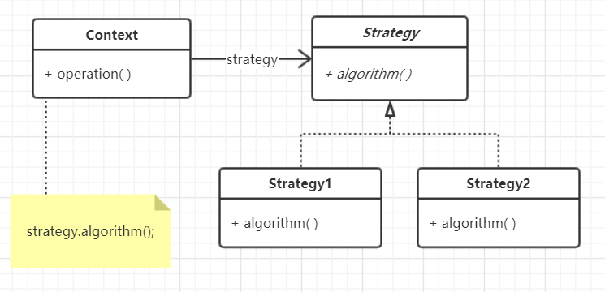
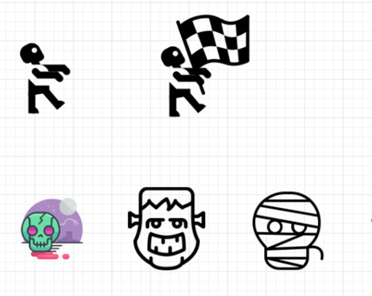

## 策略模式-- Strategy
## 模式定义:
    定义了算法族，分别封装起来，让它们之间可以互相替换，此模式的变化独立于算法的使用者。



## 案例：
类型 | 外观 | 移动 | 攻击
---|---|---|---
普通僵尸 | 普通 | 朝着一个方向移动 | 咬
骑手僵尸 | 普通+手持旗子 | 朝着一个方向移动 | 咬


类型 | 外观 | 移动 | 攻击
---|---|---|---
普通僵尸 | 普通 | 朝着一个方向移动 | 咬
骑手僵尸 | 普通+手持旗子 | 朝着一个方向移动 | 咬
大头僵尸 | 大头 | 朝着一个方向移动 | 头撞
石膏僵尸 | 石膏装 | 一拐一瘸 | 武器
XXXX僵尸 | ... | ... | ...




未完待续....
## Strategy 代码示例：
```
package com.xiaokey.design.pattern.strategy.v2;

/**
 * @author chenhao
 * @net xiaokey.com
 */
public class StrategyTest {
    public static void main(String[] args) {
        Zombie zombie = new NormalZombie();
        zombie.display();

        zombie.attack();
        zombie.move();

        zombie.setAttackable(new BiteAttack());
        zombie.attack();
    }
}

interface Moveable {
    void move();
}

interface Attackable {
    void attack();
}

abstract class Zombie {
    abstract public void display();

    Moveable moveable;
    Attackable attackable;

    public Zombie(Moveable moveable, Attackable attackable) {
        this.moveable = moveable;
        this.attackable = attackable;
    }

    abstract void move();

    abstract void attack();

    public Moveable getMoveable() {
        return moveable;
    }

    public void setMoveable(Moveable moveable) {
        this.moveable = moveable;
    }

    public Attackable getAttackable() {
        return attackable;
    }

    public void setAttackable(Attackable attackable) {
        this.attackable = attackable;
    }
}


class StepByStepMove implements Moveable {

    @Override
    public void move() {

        System.out.println("一步一步移动.");
    }
}

class BiteAttack implements Attackable {

    @Override
    public void attack() {
        System.out.println("咬.");
    }
}

class HitAttack implements Attackable {

    @Override
    public void attack() {
        System.out.println("打.");
    }
}

class FlagZombie extends Zombie {

    public FlagZombie() {
        super(new StepByStepMove(), new BiteAttack());
    }

    public FlagZombie(Moveable moveable, Attackable attackable) {
        super(moveable, attackable);
    }

    @Override
    public void display() {
        System.out.println("我是旗手僵尸.");
    }

    @Override
    void move() {
        moveable.move();
    }

    @Override
    void attack() {
        attackable.attack();
    }
}


class NormalZombie extends Zombie {

    public NormalZombie() {
        super(new StepByStepMove(), new BiteAttack());
    }

    public NormalZombie(Moveable moveable, Attackable attackable) {
        super(moveable, attackable);
    }

    @Override
    public void display() {
        System.out.println("我是普通僵尸.");
    }

    @Override
    void move() {
        moveable.move();
    }

    @Override
    void attack() {
        attackable.attack();
    }
}
```

## 应用场景:
    1.当你有很多类似的类，但它们执行某些行为的方式不同时，请使用此策略。
    2.使用该模式将类的业务逻辑与算法的实现细节隔离开来，这些算法在逻辑上下文中可能不那么重要。
    3.当你的类具有大量的条件运算符，并且在同一算法的不同变体之间切换时，请使用此模式。

## 优点:
    1.可以将算法的实现细节与使用它的代码隔离开来。
    2.符合开闭原则

### 经典案例：
    java.util.Comparator
    org.springframework.beans.factory.support.InstantiationStrategy