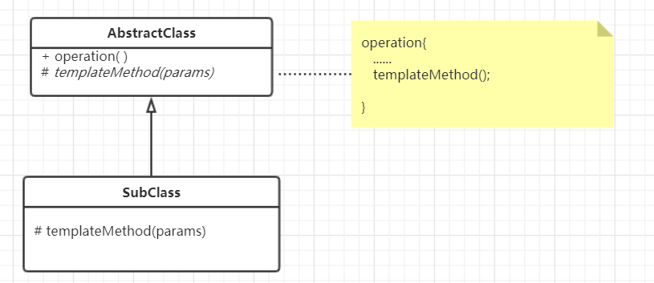

## 模板方法模式-- Template method
## 模式定义:
    定义一个操作的算法骨架，而将一些步骤延迟到子类中。Template Method 使得子类可以不改变一个算法的结构即可重定义该算法的某些特定步骤




## Template method 代码示例：
```
package com.xiaokey.design.pattern.templatemethod;

/**
 * @author chenhao
 * @net xiaokey.com
 */
public class TemplateMethodTest {
    public static void main(String[] args) {
        AbstractClass abstractClass = new SubClass1();
        abstractClass.operation();
    }
}


abstract class AbstractClass {

    public void operation() {
        // open
        System.out.println(" pre ... ");

        System.out.println(" step1 ");

        System.out.println(" step2 ");

        templateMethod();
        // ....


    }

    abstract protected void templateMethod();

}

class SubClass extends AbstractClass {

    @Override
    protected void templateMethod() {
        System.out.println("SubClass executed .  ");
    }
}

class SubClass1 extends AbstractClass {

    @Override
    protected void templateMethod() {
        System.out.println("SubClass1 executed .  ");
    }
}
```


## 应用场景:
    1.当你想让客户端只扩展算法的特定步骤，而不是整个算法或其结构时，请使用Template Method模式。
    2.当你有几个类包含几乎相同的算法，但有一些细微的差异时，请使用此模式。


## 优点:
    1.你可以让客户端只覆盖大型算法的某些部分，从而减少算法其他部分发生的更改对它们的影响。
    2.你可以将重复的代码拖放到超类中。

### 经典案例：
    javax.servlet.http.HttpServlet
    org.springframework.web.servlet.mvc.AbstractController